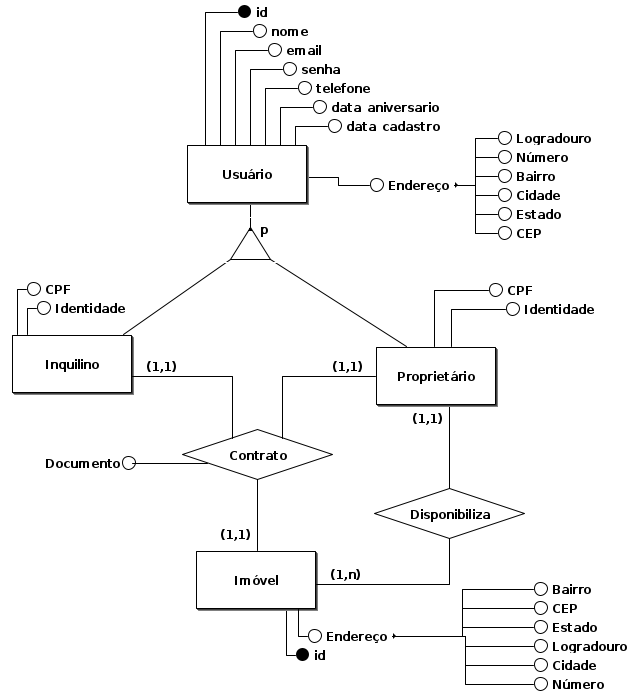

# RentEase

## Visão Geral
O **RentEase** é uma plataforma que busca criar um ecossistema de confiança para aluguéis de longo prazo. A solução permite que usuários busquem imóveis, negociem condições e gerenciem contratos diretamente, promovendo segurança e eficiência no processo de locação.

<!-- ## 🎯 Público-Alvo
O **RentEase** é destinado a:
- **Proprietários de imóveis**: para cadastrar e gerenciar aluguéis.
- **Inquilinos**: para buscar, alugar e administrar pagamentos.
- **Administradores**: para gerenciar usuários, solucionar disputas e manter a integridade do sistema.

## 🌍 Abrangência
A plataforma será inicialmente lançada na cidade de **Santarém**, com previsão de expansão para outras regiões e países conforme o crescimento da base de usuários. -->

## 🛠️ Tecnologias Utilizadas

## 📅 Status do Projeto
- 📌 Versão inicial documentada em 15/12/2024.
- 📌 Desenvolvimento em andamento.

## 👥 Equipe
- **Desenvolvimento**: <a href="https://www.linkedin.com/in/pedro-henrique-costa-menezes-791195227?lipi=urn%3Ali%3Apage%3Ad_flagship3_profile_view_base_contact_details%3BP3hGBax5TqSLZXdjeeRLdA%3D%3D"> Pedro Henrique Costa Menezes</a>

## 📄 Documentação

### Banco de dados

O banco de dados do RentEase é modelado de forma a garantir a separação adequada entre usuários, imóveis e contratos, possibilitando uma estrutura escalável e segura. A separação entre Inquilinos e Proprietários permite uma melhor organização das responsabilidades de cada usuário.

#### **Estrutura do Banco de Dados**
- A entidade **Usuário** representa todas as pessoas cadastradas na plataforma, podendo assumir os papéis de **Inquilino** ou **Proprietário**.  
- Os **endereços** são armazenados separadamente e associados a usuários e imóveis.  
- A entidade **Inquilino** herda atributos de **Usuário** e contém informações específicas de locatários.  
- A entidade **Proprietário** herda atributos de **Usuário** e contém informações específicas dos donos dos imóveis.  
- Armazena as informações sobre os imóveis disponíveis para locação.  
- A entidade **Contrato** representa o vínculo legal entre inquilino e proprietário para um determinado imóvel.  
- Essa relação indica quais imóveis estão disponíveis para aluguel pelos proprietários.

### Diagrama de Componentes

O diagrama de componentes do RentEase ilustra a arquitetura modular do sistema, destacando os principais componentes e suas interações. Ele segue um modelo baseado em arquitetura em camadas, separando responsabilidades para garantir escalabilidade, manutenção e organização do sistema.

